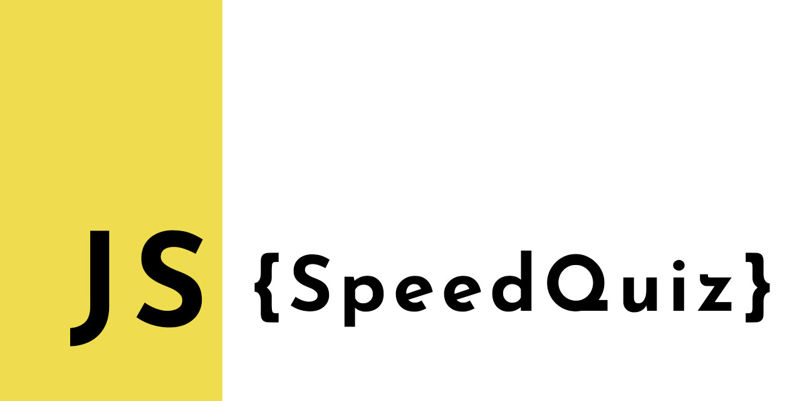
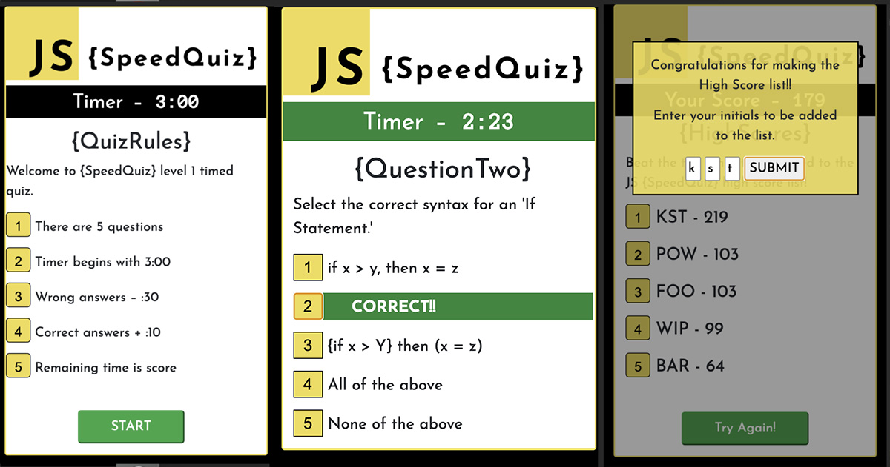

# SpeedQuiz basic JavaScrip quiz!

Test your basic JavaScript knowledge with SpeedQuiz, the stylish, responsive, fun for the whole family coding quiz! Test your knowledge and track your time against top five SpeedQuiz High Scores. Study up, and quickly try the quiz again with SpeedQuiz's convenient "Try Again" button!!

- View the app here - https://keiththarp.github.io/js-speedquiz/

## Early Steps

I started this project with wanting to be happy with the design as well as the functionality. The SpeedQuiz logo came together and guided the rest of the design. From there I started pseudo coding and working on the logic.

## Lessons In JavaScript

The overall coding of this project took me longer than I thought it would. I'm starting to feel more comfortable with the syntax, and the combination of the language and the logic are starting to feel more comfortable. I'm guessing the code could be refined and minimized, but overall, I'm very happy with the final product. 

**Swapping cards**

- I was lead to the path of swapping the display of cards for the three phases of the game by an outside suggestion early on. In hindsight I would just dynamically swap the content on the same card to help minimize code and more easily maintain consistency.

**Populating question/answers**

- This was a great project filled with many "aha" moments. Populating the questions and choices was one of those. I originally had the questions populating with a loop and the choices with a loop inside that, which I quickly realized was not going to work. I then shifted over to declaring and incrementing an iterator outside of the question populator function.

**High Scores**

- Here one of the challenges in the logic was for me to figure out how to pre-populate the high scores without rewriting them with each refresh. Adding an if statement solved the issue.

**Mobile First design**

- Using the BootStrap framework helps make the design and final product a mobile friendly app from the beginning.

**Acknowledgments and Credits**

* Thanks to Scott, Mike, & Bobby for being a great and ever patient education team!
* Tons of thanks to the several different study groups that helped keep the problem solving juices flowing this week.
* Although none of the code in here was directly copied, I found help with several problems from the usual suspects in Stack Overflow and W3 Schools. The jumping off point for the High Scores/Initials modal 'Auto Tab' code was found at http://www.javascriptkit.com/script/script2/autotab.shtml
